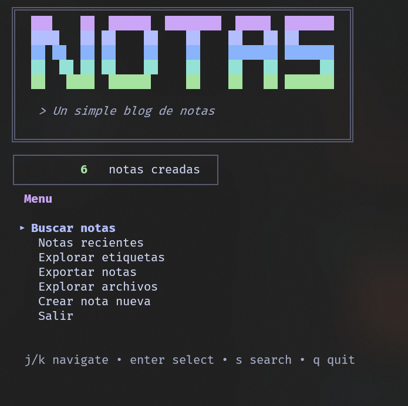
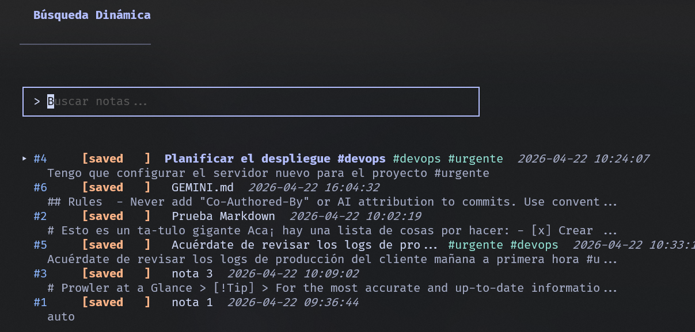
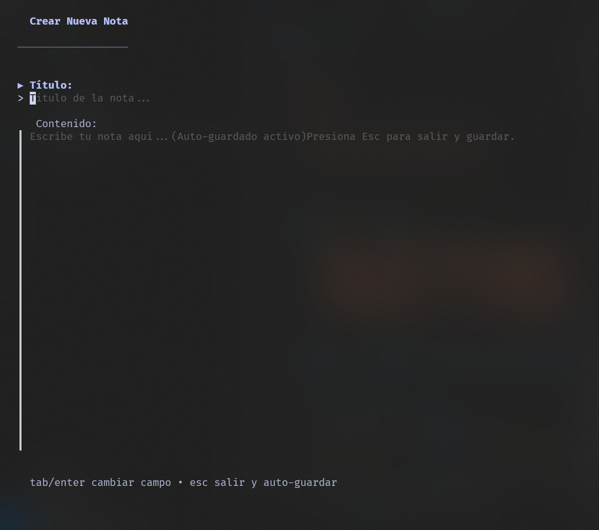
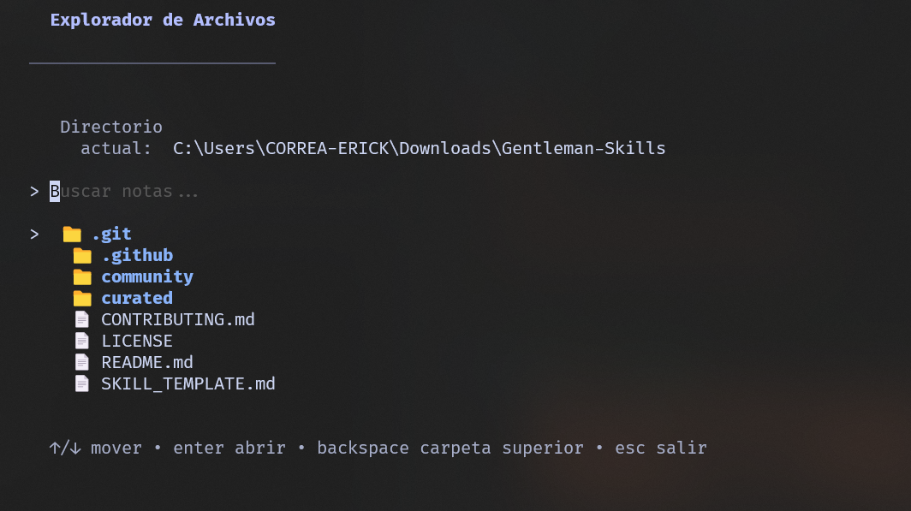
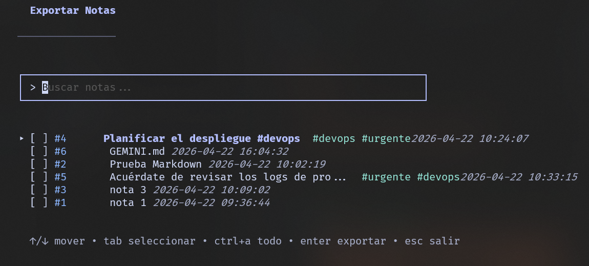

<div align="center">

# 📝 NOTAS CLI
**Un workspace de gestión de archivos avanzado y blog de notas para la terminal**

[](https://golang.org/)
[](https://opensource.org/licenses/MIT)

</div>

## 📌 Descripción

**Notas CLI** es una herramienta de terminal (TUI) extremadamente rápida y elegante para gestionar tus notas, tareas y explorar los archivos de tu sistema. Construida con Go y el ecosistema de Charmbracelet (`bubbletea`, `lipgloss`), transforma tu terminal en un entorno de productividad completo sin necesidad de levantar pesados editores visuales.

Toma gran inspiración en filosofía y diseño de la arquitectura y el repositorio de [Engram](https://github.com/Gentleman-Programming/engram) creado por **Gentleman-Programming**. ¡Asegúrate de revisar su increíble trabajo!

---

## ✨ Características Principales

- **Gestión Nativa de Notas**: Crea, edita, busca y organiza notas usando sintaxis Markdown directamente desde tu consola.
- **Sistema Híbrido Sincronizado**: Las notas pueden ser almacenadas en su base de datos local interna (`~/.notas-cli/notas.json`) o ser sincronizadas y editadas directamente como archivos físicos en tu sistema (`.txt`, `.md`).
- **Explorador de Archivos Integrado**: Navega libremente por todos los directorios de tu sistema operativo con buscador por rutas incorporado.
- **Detección Automática de Editores**: Si abres archivos de código (`.go`, `.js`, etc.) o archivos grandes, Notas CLI detectará automáticamente tus IDEs instalados (VS Code, Cursor, Antigravity, Nvim, Kiro) para abrir el archivo con ellos en un solo clic.
- **Exportador Masivo**: Convierte y exporta toda tu base de notas (o selecciones específicas) a archivos Markdown con Front-matter organizado.
- **Sistema de Etiquetas (Tags)**: Clasificación inteligente mediante hashtags (ej. `#urgente`, `#devops`).

---

## Terminal UI

| Dashboard Principal | Búsqueda Dinámica |
|:---:|:---:|
|  |  |

| Crear Nueva Nota | |
|:---:|:---:|
|  | |

| Explorador de Archivos | Exportación Masiva |
|:---:|:---:|
|  |  |


---

## 🚀 Instalación y Configuración

La herramienta está pensada para ser invocada desde cualquier lugar de tu computadora ejecutando simplemente `tui-notes` en tu terminal.

### Opción 1: Descargando el Release (Recomendado)
1. Ve a la pestaña de **Releases** en este repositorio.
2. Descarga el ejecutable `tui-notes.exe` (Windows) o el binario correspondiente a tu SO.
3. Coloca el archivo en una carpeta que esté incluida en el `PATH` de tu sistema (Por ejemplo, `C:\Windows` o preferiblemente en `C:\Users\TuUsuario\go\bin`).
4. Abre tu terminal y escribe `tui-notes`.

### Opción 2: Instalación Manual desde el Código Fuente
Asegúrate de tener **Go 1.24+** instalado en tu sistema.

1. Clona el repositorio:
   ```bash
   git clone https://github.com/ecx567/tui-notes.git
   cd tui-notes
   ```

2. Compila el binario con el alias `tui-notes`:
   ```bash
   go build -o tui-notes.exe
   ```

3. Mueve el ejecutable a la carpeta global de binarios de Go:
   ```powershell
   # En Windows PowerShell
   Move-Item -Path .\tui-notes.exe -Destination $env:USERPROFILE\go\bin\tui-notes.exe -Force
   ```
   *(Si la terminal no reconoce el comando luego de moverlo, asegúrate de añadir `$env:USERPROFILE\go\bin` a tus variables de entorno `PATH`).*

---

## ⌨️ Uso Rápido

Una vez instalado, abre tu terminal favorita y usa los siguientes comandos:

- **`tui-notes`**  👉 Abre la interfaz gráfica interactiva (TUI).
- **`tui-notes add "Texto de mi nota #idea"`** 👉 Guarda una nota rápida sin abrir la interfaz.
- **`tui-notes list`** 👉 Muestra por consola las últimas 10 notas guardadas.
- **`tui-notes export [ruta]`** 👉 Exporta tu base de datos a archivos `.md`.

---

## 🧠 Arquitectura y Privacidad

- **100% Local**: Tus datos nunca salen de tu máquina. El almacenamiento por defecto vive en `~/.notas-cli/notas.json`.
- **Sin Dependencias de SO**: Compila a un binario único.
- **Seguro**: El repositorio está configurado mediante `.gitignore` para jamás rastrear o subir datos de los usuarios, archivos `.env` o la base de datos `notas.json`.

---

## 🤝 Créditos y Agradecimientos

- Al motor de terminal **[Charmbracelet](https://charm.sh/)** por su increíble ecosistema para Go.
- **Inspiración y filosofía de diseño:** Basado e inspirado conceptualmente en [Engram](https://github.com/Gentleman-Programming/engram) desarrollado por el bacán de **[Gentleman-Programming](https://github.com/Gentleman-Programming)**. ¡Todo el crédito por sentar las bases conceptuales de este tipo de arquitecturas limpias y productivas en terminal!
